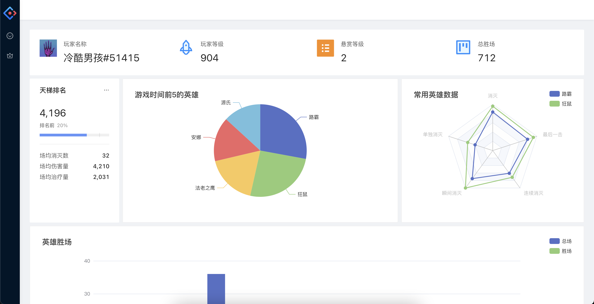

  <h1>
    📊 📈 📉
     
    Ow Dashboard
  </h1>

守望先锋生涯数据可视化看板

  
Table of contents

<!-- @import "[TOC]" {cmd="toc" depthFrom=1 depthTo=6 orderedList=false} -->

<!-- code_chunk_output -->

TODO

<!-- /code_chunk_output -->

# Get Started

开发中...

# Preview

